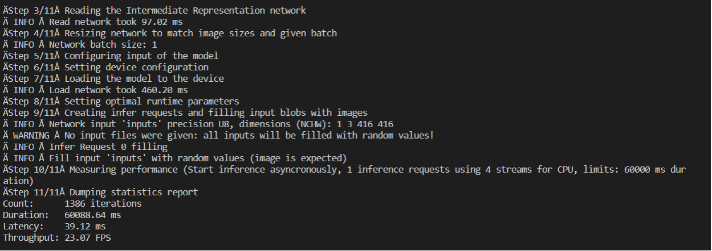
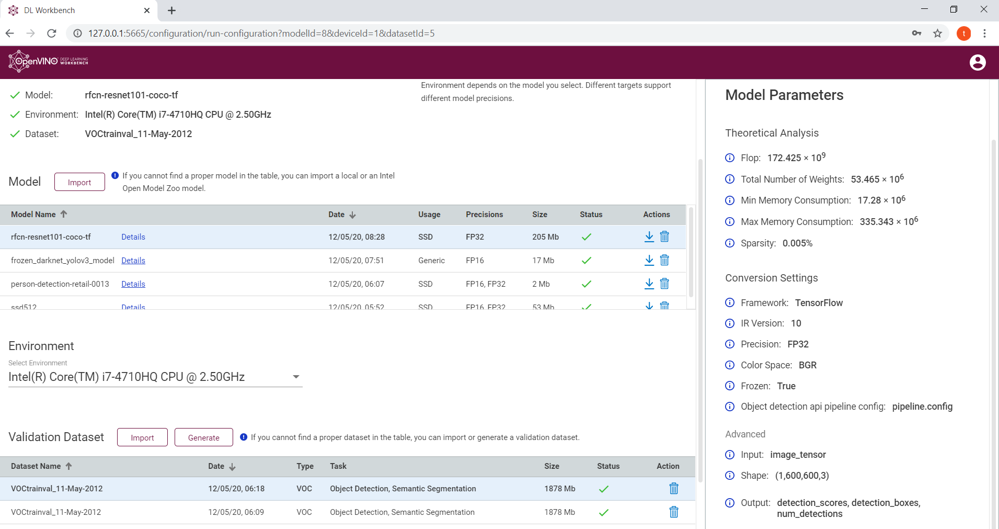
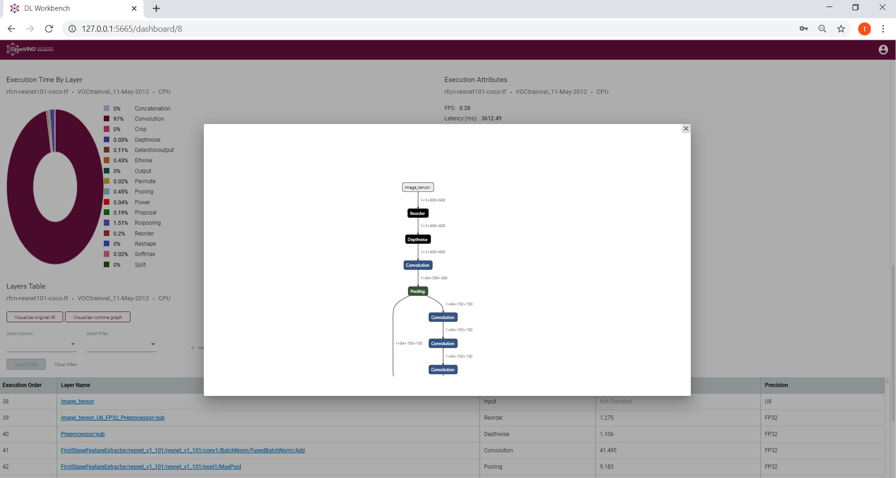
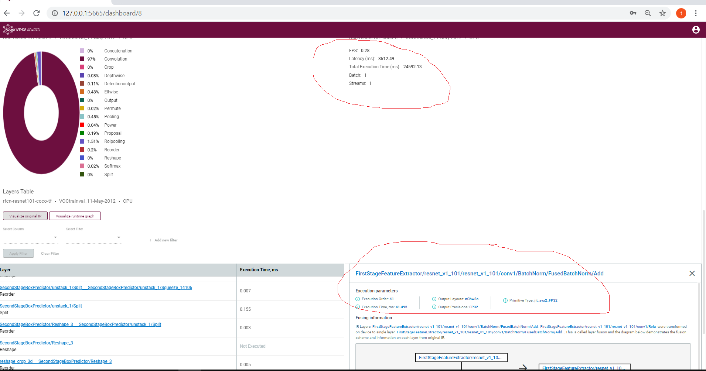

## Openvio 

  The version we are using in the application is 2020.2
  
## Models

I have used 2 public models, 1 model from github and 2 intel pretrained models, with public models and github model there is a common concern

- the size of the model I think it's still large model even openvino reduces by more than 40%, as we aimed to deploy these models on edge devices so we need to take the model size into consideration

-  as will as the speed of the model and how much resources it will consumes and this is the second aspect of not using these models, 

and after trying these models I got better result from intel pretrained models after trying different thresholding in order to get better result but it somtimes loses detection of pepeole for some frames, the intel model still get better results.

for the two intel models the have less size and less inference time but for this task and after trying the two models, I found that person-detection-retail-0013 get better redult over pedestrian-detection-adas-0002  

I have atteched all models before and after convert for anyone to review and see the result.

We can also have a summary about each model to take an overview about the model and its performance using [Inel Benchmark](https://docs.openvinotoolkit.org/latest/_inference_engine_samples_benchmark_app_README.html) which gives a good insight about each model through the following command:

```{openvino}/deployment_tools/tools/benchmark_tool/benchmark_app -m model/frozen_darknet_yolov3_model.xml -d CPU -api async -i resources\Pedestrian_Detect_2_1_1.mp4 -d HETERO:CPU``` 

Here is some results from running benchmark this command

<br/>



<br/>

.png)

There is a great tool from intel, [Openvino DL Workbench](https://docs.openvinotoolkit.org/latest/_docs_Workbench_DG_Install_Workbench.html), we can use to convert models wihtout writing scipts and also it can be used to evaluate the models, view the model layes and visualize them, you can get the excution time foreach layer and the total excution time of the mode, you can use it to optimize the model or prepare package for deployment, it have some great features

Here is some images that show that great tool




<br/>



<br/>



<br/>

Now let's move to the types of models that I have used, how I download, convert and use it, beside the the perfomance and size of each model

- Public Models

  1- ssd_mobilenet_v2_coco (FP32, FP16)

    - Model Download
    
      ```python {openvino}\deployment_tools\tools\model_downloader\downloader.py  --name ssd_mobilenet_v2_coco```

    - Model Convert<br/>

      ```python {openvino}/openvino/deployment_tools/model_optimizer/mo_tf.py --input_model=public/ssd_mobilenet_v2_coco\ssd_mobilenet_v2_coco_2018_03_29/frozen_inference_graph.pb --transformations_config {openvino}/deployment_tools/model_optimizer/extensions/front/tf/ssd_v2_support.json --tensorflow_object_detection_api_pipeline_config public/ssd_mobilenet_v2_coco/ssd_mobilenet_v2_coco_2018_03_29/pipeline.config --reverse_input_channels ```
      

    - Infer Time : 20139.82 ms
    - Model Size : 33 MB
    - Throughput(FPS): 15.14
    - Latency (ms) : 63.86


  2- ssd512 (FP16-FP32)

    - Model Download
      ```python {openvino}\deployment_tools\tools\model_downloader\downloader.py  --name ssd512```

    - Model Convert
      ```python {openvino}/deployment_tools/model_optimizer/mo.py --input_proto=deploy.prototxt --input_model VGG_VOC0712Plus_SSD_512x512_iter_240000.caffemodel```

    - Infer Time : 23209.41 ms
    - Model Size : 53 MB
    - Throughput(FPS):0.39
    - Latency (ms) 2,550.51


- Github Models

  1- Tensorflow YOLOV3 from Github Repo

    - Model Download
      
      https://github.com/mystic123/tensorflow-yolo-v3

      I have tried different model weights as stated in the repository one of them is :

        ```python convert_weights_pb.py --data_format NHWC --tiny --weights_file yolov3-tiny.weights```
    
    - Model Convert <br/>
      ```python {openvino}/deployment_tools/model_optimizer/mo_tf.py --input_model=frozen_darknet_yolov3_model.pb  --transformations_config {openvino}/deployment_tools/model_optimizer/extensions/front/tf/ssd_v2_support.json --batch 1```


      - Model Infer Time : 20114.27 ms  excluding time of extracting the bounding boxes
      - Model Size : 17 MB
      - Throughput(FPS) : 11.48
      - Latency (ms):84.48

- Intel Pretrained Models

  1- pedestrian-detection-adas-0002

    - Total Infer time : 20061.62 ms
    - Model Size : 2MB
    - Throughput(FPS): 19.94
    - Latency (ms) : 48.51


  2- person-detection-retail-0013 (FP16)
    - Total Infer time : 208352 ms when we are using Workbench we get almost the same time which is 20087.72
    - Model Size : 2MB
    - Throughput(FPS):18.77
    - Latency (ms) : 45.33


## Model Applications

- This application can have a lot of uses, that may helpful in COVID19, we can count the pepole in area to make sure they didn't exceed the limit

- we can do some processing to make sure the people acheive the required scoial distance

- we can use model to analyse ques in places such as mareks to analyze how many people we can serve and the time of each person to optimize the process

- we can use in places such as lift and send alarm if number of people goes byond the limit

- count customers in a market during different periods in day to know the trffic time which may lead to adding more cacheir in that time

- use in traffic light to detect if there is people crsodding the road while the sign is green to prevent accidents  

## Model Accuracy and Edge Reources Tradeoff

 The problem that openvion addresses is that we have limited resources, limited networking unlike clouding where  we have huge resources that we can use to run almost every model, in the edge resources we can not do that.
 
 We come to the tradeoff between having large, very accurate and poerful model that conumes huge resources and computing power or we can giveup some of the model accuracy but without great impcat on the end result.
  
 With small size model and low computing power needed we can move to edge more easy, and that is what openvino do. it cut some layers that use for training , merging some layers to minimize the size of the model and reduce computing power but we still have reasonable accuracy. 
  
 Another aspect here is the high resolution CAMs, the issue here if we need to send the frames out of the CAM to the server which have large size that we need to transmit over limited resources network, to overcome this issue the edge device can do the processing, and just sending data in specific situation such alert about finding some behaviuor or detecing sepecific object.
